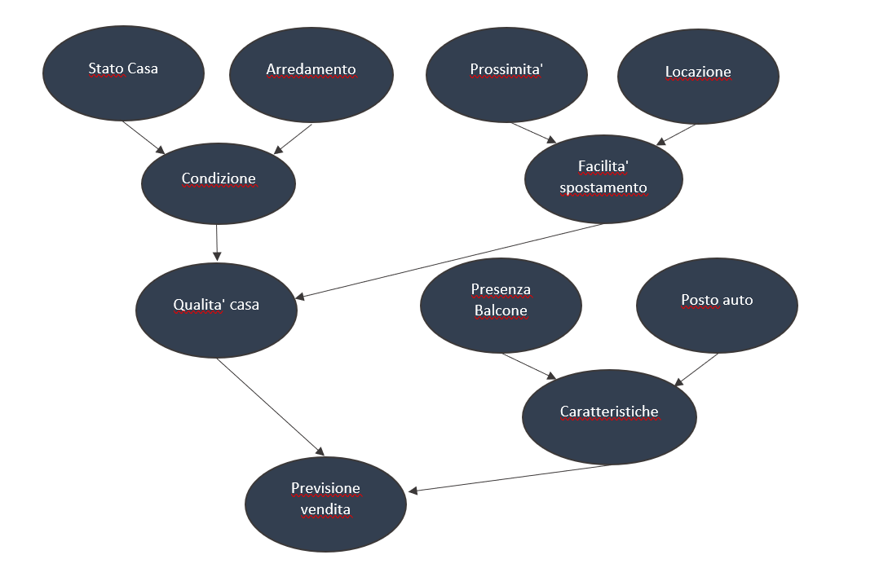

# Documentazione Real Estate Manager


## **GitHub**
**Link**: https://github.com/markomilunovic/Progetto-Icon.git

<br>


***
## **Sommario**

1. Introduzione
2. Requisiti funzionali
3. Interfaccia utente
4. Meccaniche principali
5. Sviluppo
6. Conclusioni

<br>

***
## **Introduzione**
<br>

Lo scopo di questo documento e' quello di spiegare in maniera tecnica le funzionalita' del programma **Real Estate Manager**.

Tale software e' stato implementato da : 

- **Marko Milunovic** (Matricola: 725836)

Il software in questione e' stato implementato al fine di organizzare la vendita delle case e di gestire le componenti:
1. Case(insieme di tutte le case sia in vendita che non)
2. Citta(insieme di tutte citta')
3. Zone(insieme di tutte le zone)

Gli insiemi delle case, citta' e zone sono scritti in Prolog. Ogni elemento dell' insieme contiene tre informazioni:

- ```casa(id,vendita,zona)```
- ```citta(nomeCitta,paese,regione)```
- ```zona(codiceZona,nomeCitta,disponibilita)```

Inoltre si occupa di classificare le case in base alla domanda sul mercato (attraverso l'uso di un classificatore) e di calcolare la probabilita' di poter vendere la casa sopra un determinato prezzo in base ad alcune informazioni

<br>

***
## **Requisiti funzionali**
<br>
Il programma per essere avviato necessita di alcuni pacchetti, installabili attraverso i seguenti comandi:

1. 'pybbn' -> ```pip install pybbn``` utile per la predizione;
2. 'pandas' -> ```pip install pandas``` utile per il classificatore;
3. 'tabulate' -> ```pip install tabulate``` utile per il layout delle tabele;
4. 'sklearn.tree' -> ```pip install scikit-learn``` utile per il classificatore; 
5. 'pyswip' -> ```pip install pyswip``` per la base di conoscenza in Prolog;
6.  bisognerà anche installare Swi-Prolog:
    - andare nel sito ufficiale;
    - recarsi nella sezione di download;
    - selezionare ```stable release```, scaricare la versione adatta al proprio sistema operativo;
    - successivamente installare il programma sulla propria macchina ```Add swipl to the system PATH for current user```.


<br>

***
## **Interfaccia utente**
<br>
Una volta avviato il programma verra' visualizzato un messaggio di benvenuto:

<br>
<center>

```Benvenuto nel portale RealEstate Manager.```

```Grazie al nostro aiuto potrai consultare numerose informazioni riguardanti la vendita delle case.```
</center>
<br>
E inoltre comparira' un messaggio di default a ogni interazione:

<br>
<center>

```Bisogno di aiuto? Per visualizzare la lista dei comandi digita: -1 ```

</center>
<br>
Al termine dell'esecuzione comparira' tale messaggio e l'applicazione verra' chiusa:

<br>
<center>

```Grazie per aver utilizzato il nostro servizio. Arrivederci!```

</center>

<br>
All'interno del programma inoltre vengono effettuati dei controlli riguardo l'input dell'utente. Nel caso in cui dovesse inserire un comando o una parola errata apparira' un messaggio di errore (es. se il nome della citta inserita contiene i numeri apparira' il messaggio di errore: "Valore inserito non valido. Inserire solo lettere!").

<br>

***

## **Meccaniche principali**
<br>

In questo software si e' scelto di utilizzare:

1. Un **classificatore** in grado di restituire la domanda sul mercato di una casa in vendita in base al numero di metri quadri della casa, al numero dei locali e al piano.

2. Una **rete bayesiana**, in grado di calcolare la probabilita' di vendita sopra un certo prezzo.

<br>
<br>

### **Classificatore**

E' stato utilizzato il Support Vector Machine (SVM), un algoritmo di apprendimento supervisionato utilizzato per la classificazione. Dato un insieme di esempi per il training, ognuno dei quali etichettato con la classe di appartenenza fra le possibili classi, un algoritmo di training per le SVM costruisce un modello che assegna i nuovi esempi a una delle classi.

E' stato utilizzato un file CSV all'interno del quale ci saranno le informazioni su:
* **m^2**;
* **locali**;
* **piano**.


<br>

Rispettivamente:
* Nel campo *metri quadri* e' presente un numero che identifica il numero di metri quadrati della casa, i valori vanno da 20 a 400;
* Nel *campo locali* e' presente un numero che identifica il numero di locali della casa, i valori vanno da 1 a 10;
* Nel campo *piano* e' presente un numero che identifica il piano su cui si trova la casa, i valori vanno da 1 a 10.
* Nel campo domanda abbiamo tre classi possibili:
1. bassa (la domanda per questo tipo di casa e' bassa)
2. media (la domanda per questo tipo di casa e' media)
3. alta (la domanda per questo tipo di casa e' alta)
<br>
<br>

Per creare un modello di classificazione, i dati sono stati suddivisi in training set e test set. Inoltre, e' stato utilizzato il linear Kernel. SVM funziona mappando i dati in uno spazio di feature ad alta dimensione in modo che i punti dati possano essere classificati, anche quando i dati non sono altrimenti separabili linearmente (questo viene fatto dalla funzione del kernel del classificatore SVM). Viene trovato un separatore tra le categorie, quindi i dati vengono trasformati in modo tale che il separatore possa essere disegnato come un iperpiano.

**Valutazione del sistema**

Per valutare il sistema viene utilizzato il *classification report* della libreria sklearn.metrics per creare un report di testo che mostri le principali metriche di classificazione. Le matriche utilizzate per valutare le prestazioni sono la precisione, il richiamo, la F1 score e il support score del modello di classificazione.

<br>
<br>

### **Rete Bayesiana**
Per predire la probabilita' di vendere la casa sopra un determinato prezzo e' stata usata una  **rete bayesiana**. utile per avere una stima generale quando e' presente un certo grado di incertezza. La rete e'stata realizzata con PyBBN, una libreria Python per l'inferenza esatta di Bayesian Belief Networks (BBNs) utilizzando il junction tree algorithm. 
<br>

L'utente dovra' rispondere ad alcune domande dove ogni risposta e' pesata differentemente e queste percentuali sono determinate da:

* **Stato Casa**: in quale stato si trova la casa;  
* **Arredamento**: se la casa e' arredata o meno;
* **Condizione**: contiene ```Stato casa``` e ```Arredamento```;
* **Prossimita'**: se la casa si trova in prossimita' dei servizi pubblici;
* **Locazione**: se la casa si trova in centro o in periferia;
* **Facilita' Spostamento**: contiene ```Prossimita'``` e ```Locazione```;
* **Qualita' Casa**: contiene ```Condizione``` e ```Facilita' Spostamento```;
* **Presenza Balcone**: se la casa possiede un balcone;
* **Posto Auto**: se la casa dispone di un posto per lasciare la macchina(es. garage);
* **Caratteristiche**: contiene ```Presenza balcone``` e ```Posto auto```;
* **Previsione vendita**: contiene ```Qualita'casa``` e ```Caratteristiche```;
<br>
<br>

<br>

In base alla percentuale restituita:
*  ```< 30%``` : probabilita' di vendita sopra 50 000 euro ```bassa```;
*  ```< 45%``` : probabilita' di vendita sopra 100 000 euro ```medio-bassa```;
*  ```< 60%``` : probabilita' di vendita sopra 200 000 euro ```media```;
*  ```< 80%``` : probabilita' di vendita sopra 300 000 euro ```medio-alta```;
*  ```>= 80%``` : probabilita' di vendita sopra 400 000 euro ```alta```.

<br>


***

## **Sviluppo**

<br>

Il progetto e' stato realizzato utilizzando la piattaforma gitHub e come ambiente di lavoro Eclipse. I linguaggi che sono stati utilizzati sono: python, prolog.

<br>

***

<br>

<center>

**[REAL ESTATE MANAGER]()**

</center>
